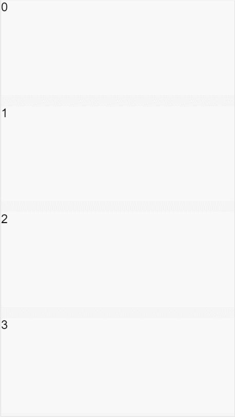

# garen-loadmore

::: tip 组件功能
+ 下拉刷新
+ 无限滚动加载
+ 自定义文案/gif
+ 获取/设置滚动距离
+ 监听滚动事件
:::



## 示例
---

```vue
<template>
  <div class="container">
    <!-- 注意：garen-loadmore要求外面包裹容器(本例.container)
    的高度固定且overflow:hidden,并且garen-loadmore内部数据的高度要大于包裹容器的高度,
    才能触发garen-loadmore的上拉加载功能 -->
        <garen-loadmore @top-method="handleTop"
                        ref="vueLoad"
                        :top-change-text="topChangeText"
                        @top-status-change="handleStatusChange" 
                        @bottom-method="handleBottom" 
                        @bottom-status-change="handleBottomStatusChange" 
                        @bottom-error-click="handleBottomError"
                        :disable-top="false"
                        :disable-bottom="false">
            <div class="item" v-for="(item,index) in dataList" :key="index">{{index}}</div>
        </garen-loadmore>
    </div>
</template>

<script>
export default {
  name: "List",
  data() {
    return {
      // 提示文案示例  
      topChangeText:{
        pulling:"下拉刷新",
        limit:"释放刷新",
        loading:"正在刷新...",
        complete:"  ",   // 刷新完成暂不提示
      },  
      bottomChangeText:{
        loading:"正在加载更多...",
        nodata:"暂无更多数据",
        error:"请求数据出错，请点击重试",
      },  
      dataList: [1, 2, 3, 4, 5]    // 模拟数据
    };
  },
  // 实现进入详情页返回列表位置功能-搭配keep-alive
  beforeRouteLeave(to, from, next) {
    // 如果进入详情页
    if (to.name === "Detail") {
        // 获得滚动距离
      let scrollTop = this.$refs.vueLoad.getScrollTop();
      // 设置缓存
      sessionStorage.setItem("listScrollTop", scrollTop);
    } else {
      // 如果去其他页移除缓存  
      sessionStorage.removeItem("listScrollTop");
    }
    next();
  },
  activated() {
    // 激活路由  
    let scrollTop = sessionStorage.getItem("listScrollTop");
    // 判断来源
    if (scrollTop == null) {
      console.log("不需要缓存的页面");
    } else {
     // 需要缓存的页面,滚动到指定位置
      this.$refs.vueLoad.setScrollTop(scrollTop);
    }
  },
  deactivated() {

  },
  methods: {
    handleTop() {
      // 下拉刷新  
      // 定时器用来模拟下拉刷新接口延迟时间
      setTimeout(() => {
         // 模拟数据更新
        this.dataList = [1, 2, 3, 4, 5];
        // 数据跟新完调用该方法使garen-loadmore滚到顶部
        this.$refs.vueLoad.onTopLoaded();
      }, 1000);
    },
    handleStatusChange(status) {
      // status监控下拉刷新状态--等待/下拉/到达阙值/刷新/刷新完成
      const TOPSTATUS = {
        wait: "wait",
        pulling: "pulling",
        limit: "limit",
        loading: "loading",
        complete: "complete"
      }; 
      console.log(status, "statuschange");
    },
    handleBottomStatusChange(status) {
      // status监控上拉加载状态--等待/加载/没有更多数据/数据请求出错  
      const BOTTOMSTATUS = {
        wait: "wait",
        loading: "loading",
        nodata: "nodata",
        error: "error"
      };
      console.log(status, "bottomchange");
    },
    handleBottom() {
      // 上拉加载
      // 定时器用来模拟上拉加载接口延迟时间
      setTimeout(() => {
      // 模拟数据更新
        this.dataList.push(1, 2, 3);
        /** 
        *  数据跟新完调用该方法使数据加载中提示消失
        *  注意:如果没有更多数据参数传false
        *  this.$refs.vueLoad.onBottomLoaded(false)
        *  注意:如果数据请求错误可调用错误处理状态
        *  this.$refs.vueLoad.onBottomError()
        */
        this.$refs.vueLoad.onBottomLoaded();
      }, 1000);
    },
    // 如果是错误状态，点击从新请求数据
    handleBottomError(){
        this.handleBottom()
    }
  },
  mounted() {
    // console.log("mounted");
  }
};

</script>
<style scoped>
.container{
    height:100%;
    width:100%;
    overflow: hidden;
    background: #f5f5f5;
}
.item{
    height:150px;
    margin-bottom:20px;
    background: #fff;
    overflow: hidden;
}
/* 注意：伪类选择最后一项是nth-last-of-type(2)不是(1) */
.item:nth-last-of-type(2){
    margin-bottom:0;
}
</style>
```
## API

### 下拉刷新配置
---
参数|类型|说明|备注
:--:|:--:|:--:|:--:
:disableTop|Boolean|禁止下拉刷新|默认:false
:distanceIndex|Number|手指滑动与页面滑动比例|默认:2
:topLoadingDistance|Number|loading状态时页面距顶部距离|默认：50
:topDistance|Number|下拉刷新触发值|默认:100
:top-change-text|Object|下拉刷新提示文案|见示例代码
@top-method|Function|下拉刷新触发方法|
@top-status-change|Function|下拉刷新状态改变回调|五种状态具体见示例代码
ref.onTopLoaded|Function|下拉刷新完成时调用函数|通过ref使用具体见示例代码
---
### 上拉加载配置:
参数|类型|说明|备注
:--:|:--:|:--:|:--:
:disableBttom|Boolean|禁止上拉加载|默认:false
:bottomDistance|Number|上拉加载触发值|默认:10
:bottom-change-text|Object|上拉加载提示文案|见示例代码
@bottom-method|Function|上拉加载触发方法|
@bottom-status-change|Function|上拉加载状态改变回调|四种状态具体见示例代码
@bottom-error-click|Function|数据请求出错点击触发方法|
:eventScroll|Function|scroll事件回调|用于监听scroll事件
ref.onBottomLoaded(boolean = true)|Function|上拉加载完成时调用函数|通过ref使用具体见示例代码(注意：如果下拉加载之后是无更多数据状态,函数传参为false,此后不在触发上拉刷新方法,下拉刷新之后会自动开启上拉加载)
ref.onBottomError()|Function|上拉加载出错时调用函数|通过ref使用具体见示例代码
---
### 其他配置:
参数|类型|说明|备注
:--:|:--:|:--:|:--:
ref.getScrollTop|Function|获得滚动距离|具体见示例代码
ref.setScroolTop(y)|Function|设置滚动距离|具体见示例代码
---
### 替换下拉刷新下拉加载loading图方法:

```html
<template slot="top">
    <div>根据topStatusChange返回的状态,设置topLoadingDistance高度,通过margin-top:负高度定位图片,渲染下拉刷新不同阶段的样式</div>
</template>    
<template slot="bottom">
    <div>根据bottomStatusChange返回的状态,渲染上拉加载不同阶段的样式</div>
</template>   

```
```css
/* 参考自定义样式css */
.garen-loadmore-header {
  margin-top: -50px;
  height: 50px;
  line-height: 50px;
  text-align: center;
  font-size: 14px;
  color: #666666;
  letter-spacing: -0.31px;
}
.garen-loadmore-footer {
  height: 50px;
  line-height: 50px;
  text-align: center;
  font-size: 13px;
  color: #666666;
  letter-spacing: -0.31px;
}  

```
