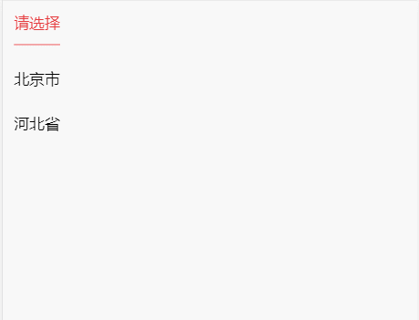

# garen-tabs

::: tip 
+ 点击切换
+ 控制切换
:::



## 示例
---
```vue
<template>
    <div class="container">
        <garen-tabs @change="tabsChange" ref="gTabs">
            <garen-tabs-item v-for="(item,index) in titleList" :title="item.name" :key="index">
                <div class="city-list">
                    <div class="city-item" :class="{'city-item-active':activeCity === option.name}" @click="handleCity(num,index)" v-for="(option,num) in dataList" :key="num">{{option.name}}</div>
                </div>
            </garen-tabs-item>
        </garen-tabs>
    </div>
</template>

<script>
// mock城市数据
const MOCK = [
  {
    name: "北京市",
    children: [
      {
        name: "朝阳区",
        children: [
          { name: "三环以内", children: [] },
          { name: "三环到四环之间", children: [] },
          { name: "四环到五环之间", children: [] },
          { name: "五环到六环之间", children: [] }
        ]
      },
      {
        name: "海淀区",
        children: [
          { name: "三环以内", children: [] },
          { name: "三环到四环之间", children: [] },
          { name: "四环到五环之间", children: [] },
          { name: "五环到六环之间", children: [] }
        ]
      },
      {
        name: "昌平区",
        children: [
          { name: "三环以内", children: [] },
          { name: "三环到四环之间", children: [] },
          { name: "四环到五环之间", children: [] },
          { name: "五环到六环之间", children: [] }
        ]
      }
    ]
  },
  {
    name: "河北省",
    children: [
      {
        name: "石家庄市",
        children: [
          {
            name: "辛集市",
            children: [{ name: "辛集县", children: [] }]
          },
          {
            name: "晋州市",
            children: [{ name: "晋州镇", children: [] }]
          }
        ]
      },
      {
        name: "邯郸市",
        children: [
          {
            name: "邯郸县",
            children: [
              { name: "河沙镇镇", children: [] },
              { name: "黄粱梦镇", children: [] }
            ]
          },
          {
            name: "峰峰矿区",
            children: [{ name: "峰峰镇", children: [] }]
          }
        ]
      }
    ]
  }
];
export default {
  props: {},

  data() {
    return {
      titleList: [{ name: "请选择", children: [] }], // title列表
      dataList: MOCK,    // 城市选择列表
      activeCity:undefined,
    };
  },

  methods: {
    tabsChange(index) {
      if(index > 0){
          const titleName = this.titleList[index - 1]
          this.activeCity = this.titleList[index].name
          this.dataList = titleName.children
      }else{
          const titleName = this.titleList[index]
          this.activeCity = this.titleList[index].name
          this.dataList = MOCK
      }
    },
    handleCity(num, index) {
      const cityData = this.dataList[num];
      this.activeCity = cityData.name
      const titleList = this.titleList;
      titleList[index] = cityData;

      if(cityData.children.length === 0){
          this.titleList = titleList
          // 改变选项卡数目，调用切换选项卡选择项，不会触@change事件    
          // 若需要触发@change,可调用this.$refs.gTabs.handleClick(index);  
          this.$refs.gTabs.mockClick(index);
          return
      }
      
      titleList[index + 1] = { name: "请选择", children: [] };
      titleList.splice(index + 2)
      this.titleList = titleList
      this.dataList = cityData.children

      this.$refs.gTabs.mockClick(index + 1);
    }
  },

  components: {},

  computed: {},

  mounted() {

  }
};
</script>
<style scoped>
.city-list {
  padding: 10px;
}
.city-item {
  height: 20px;
  padding: 10px 0;
  line-height: 20px;
  font-size: 14px;
  font-family: "-apple-system", Helvetica, sans-serif;
}
.city-item-active {
    color: #e4393c;
}
</style>
```

## API
### garen-tabs
---
参数|类型|说明|备注
:--:|:--:|:--:|:--:
@change|Function|获取title点击事件|参数 index
ref.mockClick(index)|ref调用|控制选项卡选择项|不会触发@change事件
ref.handleClick(index)|ref调用|控制选项卡选择项|会触发@change事件

### garen-tabs-item
---
参数|类型|说明|备注
:--:|:--:|:--:|:--:
:title|String|title标题|
---
### 样式覆盖
```css
/* 选项卡标题 */
.garen-tabs-header {
  position: relative;
  display: flex;
  flex-wrap: nowrap;
  width: 100%;
  height: 42px;
  padding-left: 10px;
  overflow-y: auto;
  box-sizing: border-box;
}
/* 选项卡标题上下1px细线 */
.garen-tabs-header :before {
  position: absolute;
  content: "";
  display: block;
  top: 0;
  left: 0;
  height: 1px;
  width: 100%;
  background: #ddd;
  transform: scaleY(0.5);
}
.garen-tabs-header :after {
  position: absolute;
  content: "";
  display: block;
  bottom: 0px;
  left: 0;
  height: 1px;
  width: 100%;
  background: #ddd;
  transform: scaleY(0.5);
}
/* 选项卡标题各项 */
.garen-tabs-title {
  flex-shrink: 0;
  height: 42px;
  min-width: 42px;
  margin-right: 10px;
  line-height: 42px;
  text-align: center;
  font-family: "-apple-system", Helvetica, sans-serif;
  font-size: 14px;
}
/* 选项卡标题各项激活样式 */
.garen-tabs-title-active {
  color: #e4393c;
  box-sizing: border-box;
  height: 41px;
  border-bottom: 1px solid #e4393c;
}
```